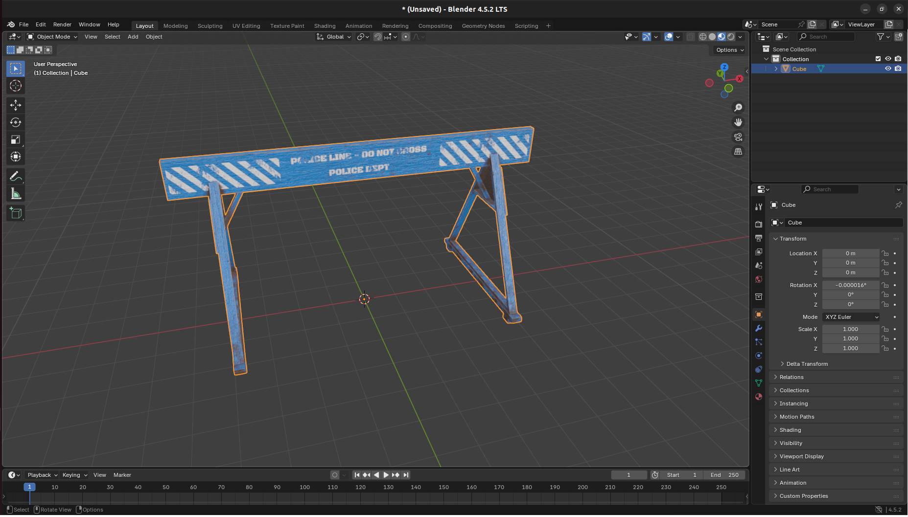
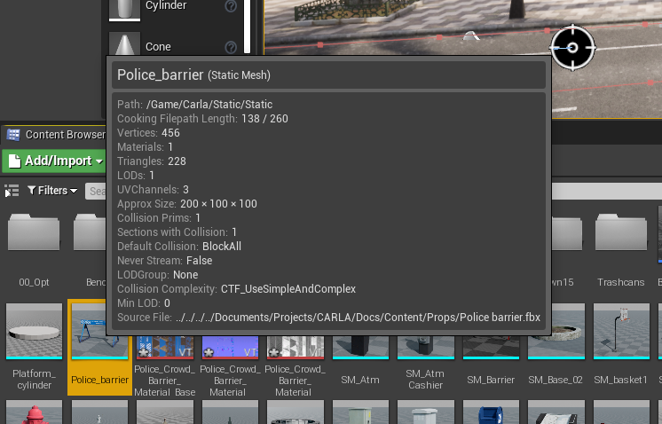
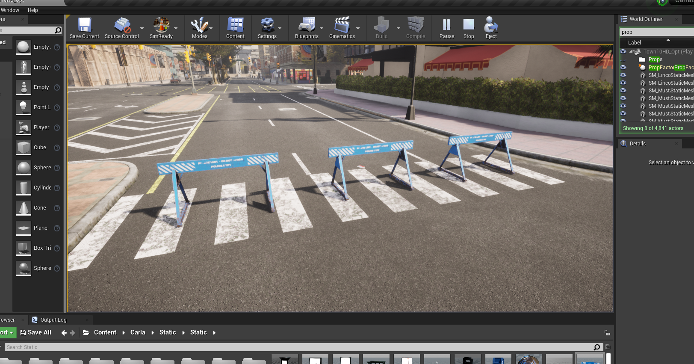
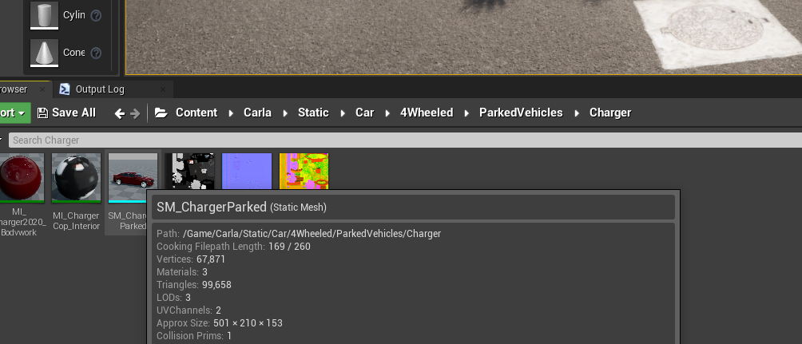
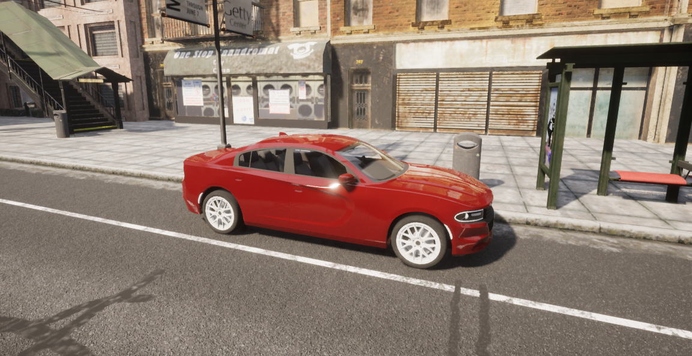

# Content authoring - props

Creating a custom prop in CARLA is quick and straightforward. Follow these steps to import and use a custom asset as a prop inside a CARLA simulation.

* __[Download or model an asset](#download-or-model-an-asset)__ 
* __[Import the asset](#import-the-asset-into-the-unreal-editor)__ 
* __[Add the new prop to the JSON configuration](#add-the-new-prop-to-the-json-configuration-file)__ 
* __[Use the new prop in simulation](#use-the-new-prop-in-the-simulation)__
* __[Make a CARLA package with new props](#make-a-carla-package-with-new-props)__ 
* __[Use a static mesh as a prop](#use-static-mesh-as-a-prop-through-the-api)__ 

---

## Download or model an asset

You may find ready-made 3D assets on sites such as [TurboSquid](https://www.turbosquid.com/) or [Sketchfab](https://sketchfab.com/) that suite your usecase (**make sure to check that the license suits your intended use**). Alternatively, if you are adept at 3D modelling, you may choose to model the object in a 3D modelling application such as Blender or Maya.



For this example, we [download an asset](https://skfb.ly/ozJB6) from Sketchfab that has a creative commons license. First, import the asset into Blender to inspect it to ensure it suits our intended use. For this asset, a couple of modifications were required to prepare it for use in CARLA:

* __Rescaling__: The asset was unrealistically large (5m tall), scaling down to 1m tall was required to suit our intended use in CARLA. Check the dimensions carefully in Blender before exporting.
* __Origin of geometry__: The origin of geometry for this asset was above the ground plane. This was moved to the scene origin since this will serve as our anchor point for the prop inside the CARLA simulation.

If the model is not already in FBX format or needed modification, export it as FBX from Blender or your preferred 3D application.

---

## Import the asset into the Unreal Editor

Now that we have an asset in FBX format, we can import it into the CARLA content library. Launch the CARLA Unreal Engine editor by running `make launch` in the root directory of the CARLA source code repository. Once the editor is open, navigate to an appropriate place in the content directories (`Content/Carla/Static/Static` in this example). Drag the FBX file into the content browser, import with the default options. Once the import is complete we can see our new prop as a static mesh in the content folder:



---

## Add the new prop to the JSON configuration file

To register the asset as a prop and use it through the CARLA API, we need to include it in the configuration file `Default.Package.json` in the `Unreal/CarlaUE4/Content/Carla/Config` directory, inside the root folder of the CARLA source code repository. Add a new entry in this file matching the format of the existing entries, locating the static mesh file that you imported (you can double check the path by hovering over the imported asset in the content browser):

```json
{
	"props": [
		{
			"name": "ATM",
			"path": "/Game/Carla/Static/Static/SM_Atm.SM_Atm",
			"size": "Medium"
		},

        ...,

		{
			"name": "PoliceBarrier",
			"path": "/Game/Carla/Static/Static/Police_barrier.Police_barrier",
			"size": "Medium"
		}
	]
}
```

---

# Use the new prop in the simulation

Start the CARLA simulation Unreal Engine editor with the play command. Once it is running, open a Python script or notebook. The new prop will be assigned the ID `static.prop.policebarrier` (i.e. `static.prop.<name_lower_case>`).

Filter for the name you entered in the name field in `Default.Package.json` in lower case and you will find a new blueprint ID for your new prop:

```py
import carla

client = carla.Client()
world  = client.get_world()
bp_lib = world.get_blueprint_library()

for bp in bp_lib.filter('*policebarrier*'):
    print(bp.id)
```

This should return:

```sh
>>> static.prop.policebarrier
```

Now you can place your new prop in the simulation in the same way as native CARLA props:

```py
barrier_bp = bp_lib.find('static.prop.policebarrier')

for spawn_loc in spawn_locations:
	world.spawn_actor(barrier_bp, spawn_loc)

```



---

## Make a CARLA package with new props

Once you have imported one or more props into CARLA using the previous steps, ensure you have saved everything in the Unreal Editor interface.You can then export a new CARLA package containing the new props using the following command:

```sh
make package #ARGS="--python-version=3.X" - for a specific Python version
```

When the export process is finished, the exported map package will be saved as a compressed archive:

* **Linux**: `.tar.gz` archive in the `${CARLA_ROOT}/Dist` directory
* **Windows**: `.zip` archive in the `${CARLA_ROOT}/Build/UE4Carla` directory

---

## Use static mesh as a prop through the API

Static meshes already included in the CARLA content library can be nominated for use as props through the Python API using the `static.prop.mesh` blueprint. Locate the desired mesh in the CARLA content browser and take note of its path. For this example we will choose the Dodge Charger model from the `/Game/Carla/Static/Car/4Wheeled/ParkedVehicles` directory. 



We can use the following code to place the vehicle in the map as a prop:

```py
# Set the path for the chosen static mesh
mesh_path = '/Game/Carla/Static/Car/4Wheeled/ParkedVehicles/Charger/SM_ChargerParked.SM_ChargerParked'
spawn_point = carla.Transform(carla.Location(x=52.7, y=127.7, z=0), carla.Rotation())

# Use the static.prop.mesh bp and set the mesh_path attribute
parked_vehicle_bp = bp_lib.find('static.prop.mesh')
parked_vehicle_bp.set_attribute('mesh_path', mesh_path)

parked_vehicle = world.spawn_actor(mesh_bp, spawn_point)
```



This method works both with the built-from-source version of CARLA and also a package version of CARLA, as long as the package contains the nominated static mesh in the correct location. 