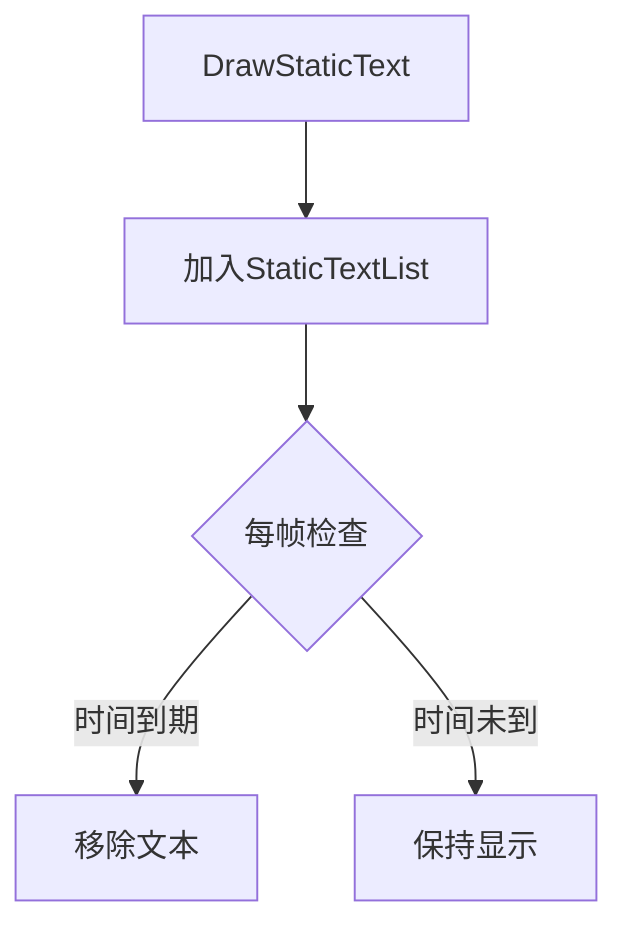

## 头显

# ADReyeVRHUD 文档

## 概述
`ADReyeVRHUD` 是基于虚幻引擎的**头显** (Head Up Display, HUD)类，继承自`ACarlaHUD`，专为虚拟现实环境设计，提供丰富的2D界面元素绘制功能。

## 核心功能

### 🖍️ 文本绘制
| 方法 | 描述 |
|------|------|
| `DrawDynamicText()` | 绘制单帧动态文本（世界坐标/屏幕坐标） |
| `DrawStaticText()` | 绘制带生命周期的静态文本 |

### 🖼️ 纹理绘制
| 方法 | 描述 |
|------|------|
| `DrawDynamicTexture()` | 单帧纹理绘制 |
| `DrawReticle()` | 持久性准星纹理 |

### 📐 图形绘制
| 类型 | 相关方法 |
|------|----------|
| 线条 | `DrawDynamicLine()` |
| 矩形 | `DrawDynamicRect()`/`DrawDynamicSquare()` |
| 十字准星 | `DrawDynamicCrosshair()` |

## 数据结构详解

### HUDText 结构
```cpp
struct HUDText {
    FString Text;    // 文本内容
    FVector2D Screen;// 屏幕坐标(X,Y)
    FColor Colour;   // RGBA颜色
    float Scale;     // 字体缩放(1.0为默认大小)
    UFont* TypeFace; // 字体对象(空时使用默认字体)
};
```


## 生命周期管理

