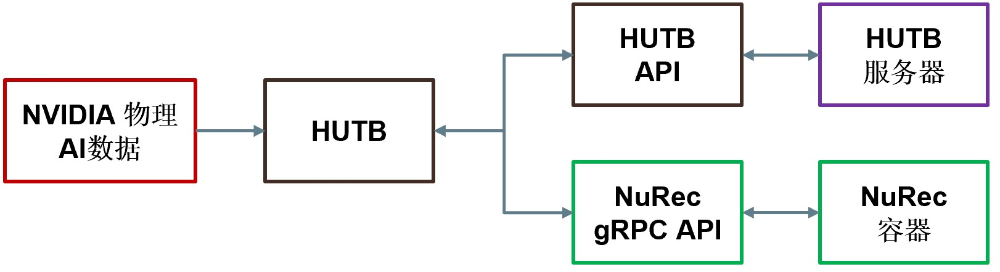

# 将 NVIDIA 神经重建与 HUTB 结合使用

NVIDIA 神经重建 (Neural Reconstruction, NuRec) 是指 NVIDIA 提供的重建和渲染模型及服务，支持无缝提取真实世界数据并将其转换为适合训练和测试物理 AI 代理（包括机器人和自动驾驶系统）的模拟环境。

借助 NuRec，开发者可以将记录的摄像头和激光雷达数据转换为 3D 场景。NuRec 使用多个 AI 网络创建交互式 3D 测试环境，开发者可以在其中修改场景并观察外部环境的反应。开发者可以更改场景、添加合成对象并应用随机化效果（例如，孩子跟随弹跳的球冲向道路），从而让初始场景更具挑战性。借助 NuRec gRPC API，开发者可以将渲染服务直接引入他们选择的模拟平台，例如 HUTB。


NuRec gRPC API 充当 HUTB 回放和 NuRec 容器之间的数据和渲染管道，场景在 NuRec 容器中重建和渲染。您可以从 NVIDIA 自动驾驶汽车物理 AI 数据集加载预先训练的场景，并使用 NuRec gRPC API 在 Python 脚本 (`replay_recording.py`) 中定义场景。下图进一步说明了 NuRec 与 HUTB 之间的关系。




运行回放脚本时，**HUTB** 会通过 **HUTB API** 从 **HUTB 服务器** 加载地图和 Actor。脚本中的渲染请求会通过 **NuRec gRPC API** 从 **NuRec 容器** 返回帧。这两个 API 均可作为 HUTB 和 NuRec 服务器的便捷接口，为您的模拟提供无缝更新。

要在 HUTB 模拟中使用神经渲染，请使用 NVIDIA 神经重建 API 和 **NVIDIA 物理 AI 数据** 集中的数据。请按照本指南中的说明进行操作。


## 开始之前

在开始之前，请确保您已满足以下先决条件：

- [CARLA 0.9.16 或更新的安装](https://carla.readthedocs.io/en/latest/start_quickstart/#carla-installation)
- CUDA 12.8 或更高的版本
- [NVIDIA container toolkit](https://docs.nvidia.com/datacenter/cloud-native/container-toolkit/latest/install-guide.html)
- Python 3.10+

## 设置

要开始使用 NVIDIA 的示例数据集，请使用安装程序脚本。如果您希望自定义数据集，请按照说明从 HuggingFace 获取资源并手动设置环境。


### 使用安装程序脚本

要快速轻松地开始使用 [NVIDIA PhysicalAI-Autonomous-Vehicles-NuRec 数据集](https://huggingface.co/datasets/nvidia/PhysicalAI-Autonomous-Vehicles-NuRec) 中精选的样本集，请导航到计算机上的 CARLA 目录并运行以下启动脚本：


```bash
./PythonAPI/examples/nvidia/install_nurec.sh
```

该脚本可帮助您设置 HuggingFace 访问令牌（如果还没有），设置 NuRec 容器所需的环境变量，从 HuggingFace 中提取精选的示例数据集，并安装所需的 Python 包。


### 使用自定义数据集

如果您希望自定义使用的数据集，请按照以下说明获取资产、启动 NuRec 容器并安装所需的 Python 包。

1. 从 [HuggingFace 上的 NVIDIA PhysicalAI-Autonomous-Vehicles-NuRec 数据集](https://huggingface.co/datasets/nvidia/PhysicalAI-Autonomous-Vehicles-NuRec) **获取预先训练的资产**。

2. **设置你的环境。** 在你的机器上的 HUTB 目录下运行以下命令，下载并安装所需的 Python 包：

    ```
    pip install -r requirements.txt
    ```

3. **设置环境变量。** 重放脚本需要两个环境变量 — `NUREC_IMAGE` 和 `CUDA_VISIBLE_DEVICES`:

    * `NUREC_IMAGE` 是必需的，必须将其设置为 HUTB 仓库中 NuRec 镜像的完整路径。运行以下命令进行设置： 

        ```
        export NUREC_IMAGE="docker.io/carlasimulator/nvidia-nurec-grpc:0.1.0"
        ```

    * [`CUDA_VISIBLE_DEVICES`](https://docs.nvidia.com/cuda/cuda-c-programming-guide/index.html#env-vars) 是可选的，您可以使用它来指定运行回放的 GPU。如果您未将其设置为特定的 GPU，则脚本默认为“0”，并在 GPU 0 上运行。如果您已设置此环境变量，则脚本将继承先前设置的内容。


## 运行 HUTB NuRec 重放

**1. 启动 HUTB 服务器。**  在 HUTB 软件包所在的目录中，运行以下命令：

```
./CarlaUE4.sh
```

**2. 重放 NuRec 场景。** HUTB 运行后，打开一个新的终端窗口并导航到 HUTB 包所在的目录，然后使用以下脚本之一重放 NuRec 场景：  

* **多摄像头回放：** 该脚本提供了一个完整的多视图可视化系统，非常适合了解如何集成各种摄像头类型并创建全面的监控设置。运行该脚本时，它会在 Pygame 显示网格中以不同的摄像头位置回放多个 NuRec 摄像头（前摄像头、左交叉摄像头、右交叉摄像头）的模拟结果。它还支持从连接到目标车辆的标准 HUTB 摄像头提取的额外视角，以及具有不同帧率和分辨率的多个摄像头信号。 

```
source carla/bin/activate
cd PythonAPI/examples/nvidia/
python example_replay_recording.py --usdz-filename /path/to/scenario.usdz

```

* **自定义相机参数：** 如果您需要复制特定的相机硬件或匹配真实世界的相机校准，请使用此脚本配置 NuRec 相机的自定义固有参数。可用的高级相机配置包括自定义 F-Theta 配置、精确的固有参数指定（主点、畸变多项式）、通过相机变换矩阵进行自定义定位、滚动快门模拟以及使用 Pygame 进行实时可视化。 


```
source carla/bin/activate
cd PythonAPI/examples/nvidia/
python example_custom_camera.py --usdz-filename /path/to/scenario.usdz
```

* **图像捕获：** 如果您需要从场景回放中导出并保存图像，请使用此脚本。它会回放 NuRec 场景并从 NuRec 和 HUTB 摄像头捕获图像，然后将它们保存到指定的输出目录。您可以自定义 NuRec 摄像头的帧速率和分辨率，将标准 HUTB 摄像头连接到目标车辆，使用 Pygame 显示实时摄像头图像，并将捕获的图像以 JPEG (.jpg) 文件格式保存到按摄像头类型分类的文件夹中。 

```
source vecarla/bin/activate
cd PythonAPI/examples/nvidia/
python example_save_images.py --usdz-filename /path/to/scenario.usdz --output-dir ./captured_images
```

根据需要使用尽可能多的示例场景运行重放脚本。

### 命令行参数

下表解释了脚本可用的命令行参数：

| 参数               | 长格式 | 默认                       | 描述                      |
|------------------|-----------|--------------------------|-------------------------|
| -h               | --host | 127.0.0.1                | HUTB 主机服务器的 IP 地址       |
| -p               | --port | 2000                     | HUTB 服务器的 TCP 端口        |
| -u               | --usdz-filename | (必需的)               | 包含 NuRec 场景的 USDZ 文件的路径 |
| -c               | --camera | camera_front_wide_120fov | 用于可视化的相机名称              |
| --move-spectator | | False                    | 移动观察者摄像机来跟随自主车辆       |

## 其他

* [HUTB - NUREC 集成](ue/HUTB_NUREC_integration.md)
* [NUREC 集成工具](ue/tools.md)
* [NVIDIA 神经重建引擎 gRPC 协议缓冲区](ue/grpc_proto.md)